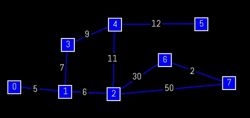

# kruskal-sfml

A simple visualization of Kruskal finding the minimum spanning tree on custom graph in C++ with the help of SFML.

# How it works:

- Click anywhere on SFML window to draw a node.
- Click on an existed node to start drawing a line from it.
- Click on another existed node to finish that line and create an edge between those in graph.
- Re-click on the node where line starts to cancel the line drawing
- Type a positive number on the (CLion) Run tool window to assign that value to the newly created edge.
- Press Space bar to find the MST of the graph. Remember all nodes must be connected.

# Structure:

- **Graph** has a vector of **Edge**
- **Edge** has a pair of **Nodes** as vertices, a weight and a **Line**
- **Line** is simply a sf::RectangleShape with a start and end position
- **Node** is the smallest unit of graph with unique id (data).
# Demo:

# Library:

SFML (version 2.5.1)

